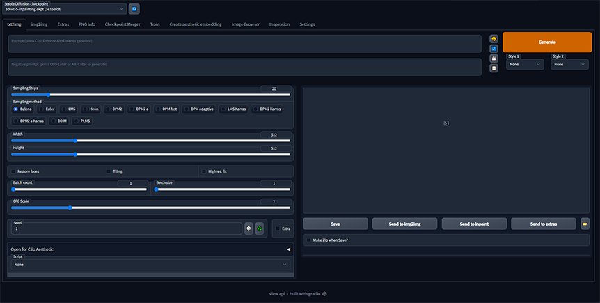

# Stable Diffusion WebUI Initializer

<p align="center">
    <a href="" target="_blank">
        
    </a>
</p>


Welcome to the **Stable Diffusion WebUI Initializer** repository! This repository provides tools to easily initialize and manage the Stable Diffusion WebUI. With the included `Makefile`, you can quickly start the WebUI, launch it in different modes, or initialize it with a single command.

---

## 🛠 **Features**

- **Simple Initialization**: Use the `Makefile` to easily initialize the WebUI environment.
- **WebUI Launch Options**: Start the WebUI with or without a frontend, depending on your requirements.
- **API Access**: Enable API access for integration with other applications.
- **Custom Port**: Configure the WebUI to run on your desired port.

---

## 📦 **Installation**

1. **Clone the Repository**

First, clone this repository and the Stable Diffusion WebUI repository:

```bash
git clone git@github.com:Abdelmathin/stable-diffusion-webui-initializer.git
cd stable-diffusion-webui-initializer
```

2. **Set Up Dependencies**

Make sure to install all required dependencies. If there are any Python package dependencies, install them using:

```bash
pip install -r requirements.txt
```

## 🚀 Usage

You can use the provided `Makefile` to run various tasks.

### Start the WebUI

To start the WebUI in the parent `stable-diffusion-webui` directory:

```bash
make start
```
This will launch the Stable Diffusion WebUI by running `relauncher.py`.

### Launch WebUI with API

To start the WebUI on port `3002` with API access:

```bash
make webui
```

The WebUI will be available at `http://localhost:3002`.

### Launch API without WebUI

To run the API server without starting the WebUI (useful for backend-only workflows):

```bash
make no-webui
```

This command will start the API server without any graphical user interface.

### Initialize Scripts

To initialize the Stable Diffusion environment, run:

```bash
make init
```

This will execute the `init.py` script to set up the required environment.

## 🛡 License

This project is licensed under the MIT License - see the LICENSE file for details.

## 🤝 Contributing

Contributions are welcome! If you have suggestions, ideas, or find any issues, feel free to submit a pull request or open an issue in this repository.

## 💬 Support

For any questions, please reach out via GitHub Issues or contact me at abdelmathinhabachi@gmail.com.

## 🌟 Fun Fact

Did you know that Stable Diffusion can generate photorealistic images just from text prompts? Dive into the creative power of AI with this WebUI!

